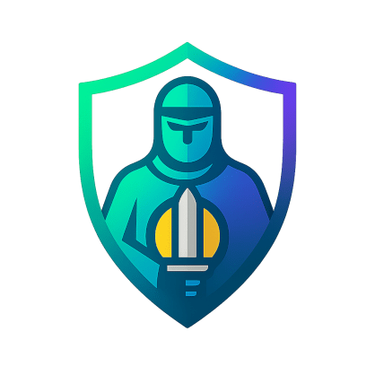

<h1 align="center">
Soteria Network [SOTER]  
<br/><br/>

</h1>


<p align="center">
    <a href="https://discord.gg/Uv4bBnGc2C">
        
    </a>
    <a href="https://x.com/Soteria_Network">
        
    </a>
    <a href="https://bsky.app/profile/soteriaofficial.bsky.social">
        
    </a>
    <a href="https://t.me/soteria_official">
        
    </a>
    <a href="https://www.livecoinwatch.com/price/SOTERIA-_SOTER">
        
    </a>
    <a href="https://coinpaprika.com/coin/soter-soteria/">
        
    </a>
    <a href="https://www.tiktok.com/@soteriafoundation">
        
    </a>
    <a href="https://medium.com/@soteriaofficial">
        
    </a>
<a href="PLACEHOLDER_URL_INSTAGRAM">
    
</a>
<a href="https://www.facebook.com/SoteriaNetworkOfficial/">
    
</a>
<a href="PLACEHOLDER_URL_COINMARKETCAP">
    
</a>
<a href="PLACEHOLDER_URL_YOUTUBE">
    
</a>
<a href="PLACEHOLDER_URL_COINGECKO">
    
</a>
<a href="https://blockspot.io/coin/soteria-4/">
    
</a>   
</p>


# What is Soteria?

Soteria Network based on RVN/BTC Core designed for efficient and interoperable asset management. 
Taking development cues from Ravencoin and latest versions of Bitcoin, Soteria Network currently
employs a completely new variant of dynamic and timestamped energy friendly hashing algorithms, 
SoterG for GPU. The assets in Soteria can be automated using Soteria Smart Plans
allowing the creation of decentralized applications using Lua VM.
The network prioritizes usability, automation, and low fees to make asset minting and management
simple, affordable, and secure. The network's economy runs on SOTER, our native coin that can be
mined using GPUs.

For detailed information, visit **Website:** [soteria-network.online] https://soteria-network.online

### Coin Specs

<table>
<tr><td>Name & ticker</td><td>Soteria Network (SOTER)</td></tr>
<tr><td>Consensus algorithm</td><td>PoW</td></tr>
<tr><td>PoW block reward</td><td>Dynamic starting from 0.18 SOTER at genesis, reduced continously</td></tr>
<tr><td>Hashing algorithm</td><td>SoterG</td></tr>
<tr><td>Maximum SOTER supply</td><td>1,500,000</td></tr>
<tr><td>Premine</td><td>0 SOTER</td></tr>
<tr><td>Blocksize</td><td>3 MB</td></tr>
<tr><td>Blocktime average</td><td>12 seconds (LWMA-EMA v3)</td></tr>
<tr><td>Number of transaction confirmations</td><td>6</td></tr>
<tr><td>Mined Maturity</td><td>4201 confirmations</td></tr>
<tr><td>Transaction Maturity</td><td>6 confirmations</td></tr>
<tr><td>Difficulty Readjustment</td><td>Every 60 blocks (LWMA-EMA v3)</td></tr>
</table>


### Key Features & Advantages

##### Ultra-High Performance

    Lightning-fast 10‑second block confirmations with a 6‑second buffer cap.
    Industry-leading up to 2000 TPS capacity.
    Smart contract supports using Lua VM integrated.
    3 MB blocks for maximum throughput.
    Optimized codebase for fast block time and minimum orphan rate.
    Modern C++ features, C++ best practices, best thread and memory management, updated dependencies to almost latest possible versions.
    Efficient and energy friendly algorithms for mining, crafted for Soteria Network.
    Sustainable tokenomics and all fees will be burned quarterly.
    The total supply is so limited that emission is controlled.
    6 months of development until release to bring the best possible features and we will keep developing days and nights.
    
##### Bank-Grade Security

    FORK ID integrated from genesis to prevent against replay attacks.
    Multi-layered consensus security using best and latest modern practices.
    Advanced cryptographic algorithms.
    Comprehensive testing and audit framework.
    Resistance against common attack vectors, surface attacks, race conditions, warp timestamp attacks and manipulations.

##### Wallet Features

    IPFS content browser integration.
    Advanced transaction controls and low transaction fees.
    Dusting function integrated to deal with dust amounts.
    Multi-signature support.
    Hardware wallet compatibility.
   

### Branches

There are **3** types of branches:

- **master:** *Stable*, contains the code of the latest version of the latest *major.minor* release.
- **maintenance:** Stable, contains the latest version of previous releases,
  which are still under active maintenance. Format: ```<version>-maint```
- **development:** Unstable, contains the latest code under development and the new code for
 upcoming releases. Format: ```<version>-dev```

***Submit your pull requests against `master`***

*Maintenance branches are exclusively mutable by release. When a release is*
*planned, a development branch will be created and commits from master will*
*be cherry-picked into these by maintainers.*

## Contributing 🤝

Please see [the contribution guide](CONTRIBUTING.md) to see how you can
participate in the development of Soteria Core. There are often
[topics seeking help](https://github.com/soteria-network/soteria/labels/help%20wanted)
where your contributions will have high impact and get very appreciation.

If you find a bug or experience issues with this software, please report it
using the [issue system](https://github.com/soteria-network/soteria/issues/new?assignees=&labels=bug&template=bug_report.md&title=%5Bbug%5D+).


### Running on Mainnet

Use this command to start `soteriad` (CLI) on the mainnet.
<code>./soteriad</code>

Use this command to start `soteria-qt` (GUI) on the mainnet.
<code>./soteria-qt</code>


